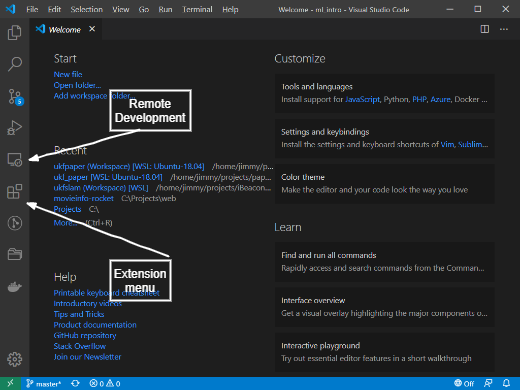
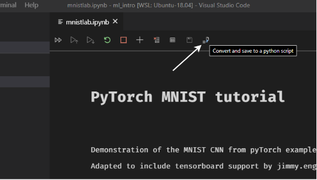
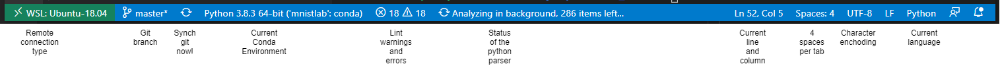
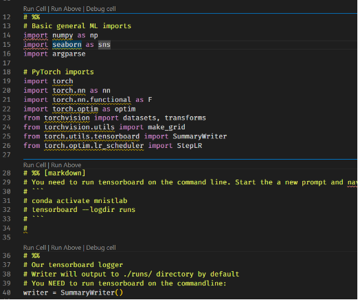
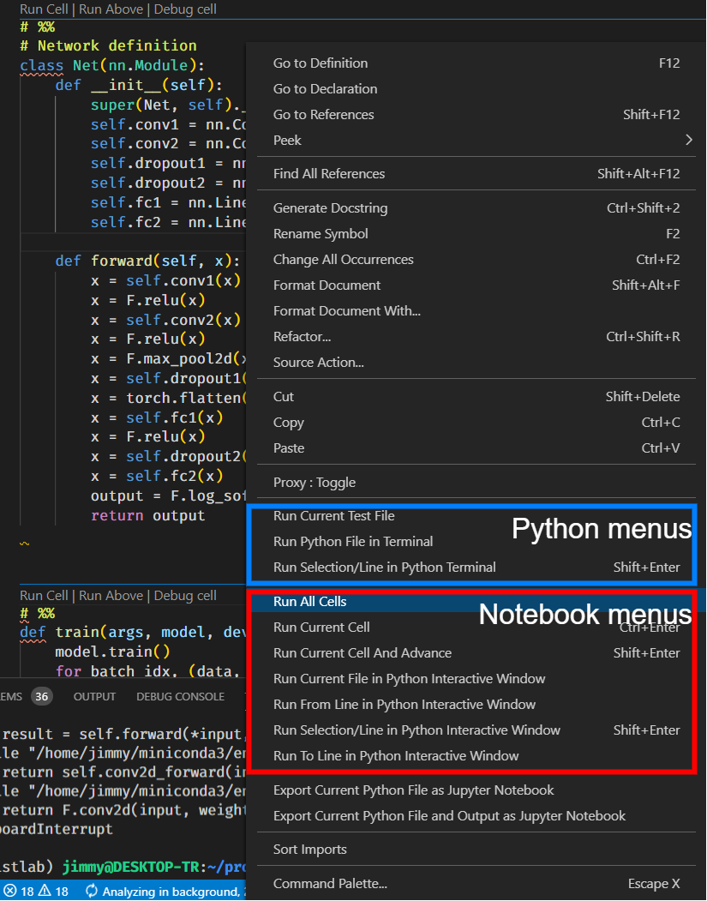
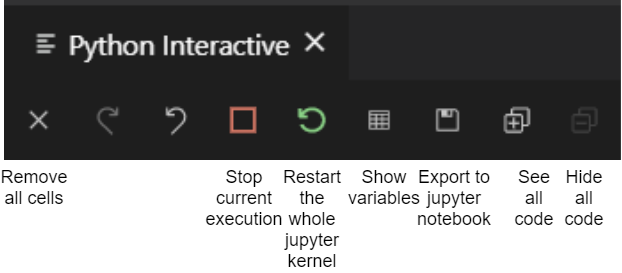
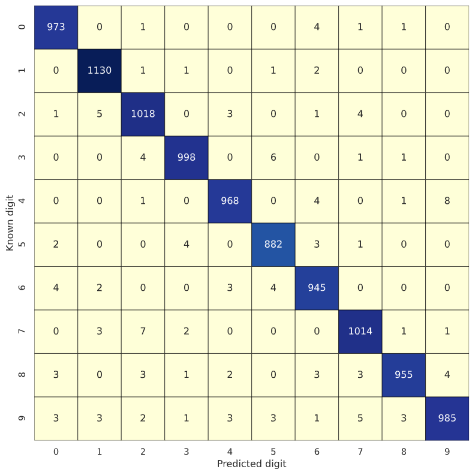

# A Very quick Introduction to ML with pyTorch using a remote VS Code session

By: Jimmy Engström 2020-06-08

jimmy.engstrom@sony.com


## Prerequisites

### Server side installation of Python libraries
Follow the instructions in [Readme_jupyter.md](./Readme_jupyter.md) and install conda, Python and PyTorch on your **remote machine**.

### Generating ssh key

Choose a server or virtual machine that you have SSH access to.

On our local (preferred) or remote machine, generate an SSH-key using ssh-keygen:
(we use ECDSA which has shorter keys than RSA)

```
ssh-keygen -f ~/.ssh/vscode_intro -t ecdsa -b 521
```

This generates two files:
vscode_intro
vscode_intro.pub

**vscode_intro** is your private, **vscode_intro.pub** is your public key.
The **public key** is the one you will keep on the server.

copy the public key to the server. Your first alternative is using ssh-copy-id

```
ssh-copy-id -i ~/.ssh/vscode_intro user@host
```
And then you are done.

If you don't have ssh-copy-id, you can do it manually:

open up the ~/.ssh/authorized_keys file on the server, using e.g. **vi**
```
vi ~/.ssh/authorized_keys
```
press **a \<Enter\>**

paste the content of your **vscode_intro.pub** file.

press **:wq!** to exit vi and save changes.

Make sure the file has the correct access rights by 
```
chmod 700 ~/.ssh
chmod 600 ~/.ssh/authorized_keys
```

On your desktop (local) computer, configure ssh as follows:

Edit **~/.ssh/config**

Add this text

```
Host myshortname realname.example.com
    HostName realname.example.com
    IdentityFile ~/.ssh/vscode_intro
    User remoteusername
```
But replace line 1,2 and 4 with the correct information of your host.
Doing this will allow you to login to your server without entering a password, which is very important for having good user experience when using VS Code remotely.

Now you are ready for installing VS Code.

## Installing VS Code

Install Vs Code on your local machine, either from https://code.visualstudio.com/, or e.g. using Ubuntu snap
```
sudo snap install --classic code
```

Start VS Code.
You will be welcomed by this interface:



Click on the extension menu and install the extension called "Remote Development" by Microsoft.

Once it's installed, you will get an icon for "Remote Development".

If you click that icon you will see all server you have in your ~/.ssh/config file.

Click on the remote computer you previously installed your SSH-key on, and choose to connect. You should now be logged in without any password dialogs. You may get a question whether you trust the remote computer (as it may be the first time you use the ssh key). Press accept. 

VS Code will now connect to your remote computer and install a version of VS Code in your remote home directory. Once that is completed, you can browse the servers directories and edit files. You **do not need** to install a complete version of VS Code using apt-get install on the remote machine. Everything is handled by your local VS Code software.

Click on the "Terminal Menu" and choose "New Terminal". This will open a window where you have a remote shell. You want to download this project into a new directory.

Clone this repo into a new folder:
```~
git clone https://github.com/DataScientistsR7337/ml_intro.git ml_intro
```
In VS Code: open the project folder through "File -> Open Folder".

You will see a few files in the project directory. Open the `mnistlab.ipynb` file, which is the Jupyter notebook. VS Code will now prompt you to install the Python extension, which you want.

After a while, you will see a notebook interface that is similar to Jupyter. However, in this session we will try another approach than notebooks. Close the file again after you have browsed through the notebook to get a rough hang of the layout. 


In the upper part of notebook, you see a small icon that says "Convert and save to a python script". 



This will create a new (unsaved) file that you should save as python script. Choose "File -> Save As" and use `mnistlab.py` as filename. Then open the mnistlab.py file (if you ever closed it).

On the bottom of the window, you see a few items that are the following (a bit depending on if you have extra extensions installed or not)



Make sure that you use the right Conda environment by clicking on the status bar and choose `mnistlab` that you created at an earlier stage.

# Running Python in Vs Code.

Vs Code detects code cells by looking for the magic command
```
# %% (This part will be seen as a comment in the running notebook)
```

When it sees that, it adds menus in the code for running a single cell

* Run Cell
* Run Above
* Debug Cell (if applicable)



Now, running each cell in order may be a bit tedious, so you may run all cells at once (in order) by clicking the right mouse button and choose "Run All Cells" in the notebook menu. If you choose menu options in the **blue** area, the code will be run in an **ordinary python terminal**, which means that it will exit as soon as all cells has complete running. This may, or may not be what you want, but usually when we run notebooks, we want to keep the results in memory for further use, such as plotting and diagnostic printing of variables.

So, unless you really need the script to exit, choose from the Notebook menus.



When VsCode runs your code, the output will be in the right iPython window, but only the first line of each cell, and the output result of the cell will be seen. 



Hopefully, you code has now complete running. At the bottom of you code, add the following

```python
# %% Show result of training
import pandas as pd
from sklearn.metrics import confusion_matrix
import seaborn as sns

sns.set()
sns.set_context("notebook")

model.eval()
test_loss = 0
correct = 0
output_classes = []
test_classes = []
with torch.no_grad():
    for data, target in test_loader:
        data, target = data.to(device), target.to(device)

        test_classes.extend(target.tolist())

        output = model(data)
        predicted = output.argmax(dim=1)
        output_classes.extend(predicted.tolist())

confusion_matrix_df = pd.DataFrame(confusion_matrix(test_classes, output_classes))  # noqa
fig, ax = plt.subplots(1, 1, figsize=[10, 10])
sns.heatmap(confusion_matrix_df, annot=True, fmt="d",
            linewidths=.5, linecolor="black", ax=ax, cmap="YlGnBu", cbar=False, square=True)
ax.set_ylabel("Known digit")
ax.set_xlabel("Predicted digit")


```

This will evaluate the model and plot a confusion matrix, which shows what digits are correctly classified, and which are less likely to be classified correctly. This is useful to see if an ML-model has some classes that it has trouble distinguishing between.



In our case, we see that the number “7” and “2”, together with “4” and “9” are the ones most often confused.

One further improvement to this, would be to store the indexes of the confused samples. Then the incorrect samples can be rendered and be judged if the error really is a classification error, or if the training and testing data needs data cleaning. This is left as an exercise to the reader.


